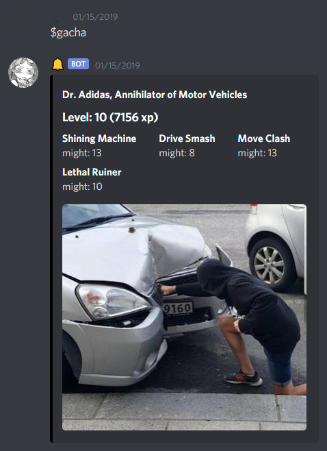
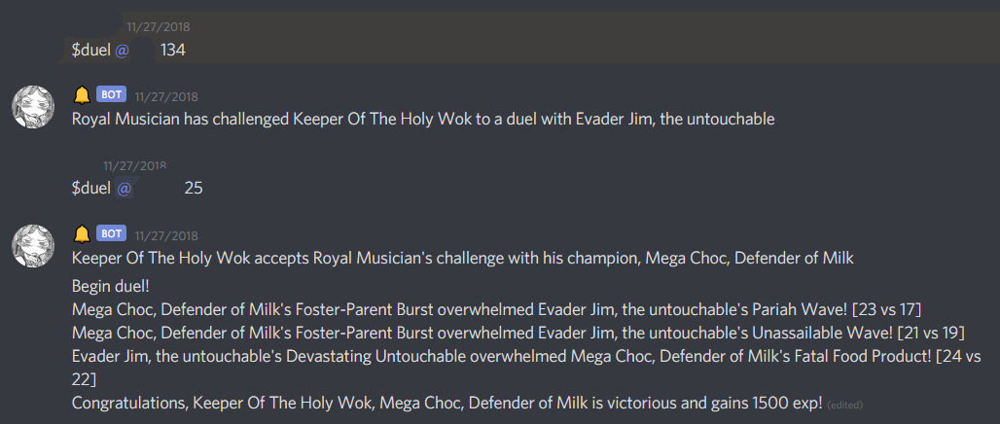
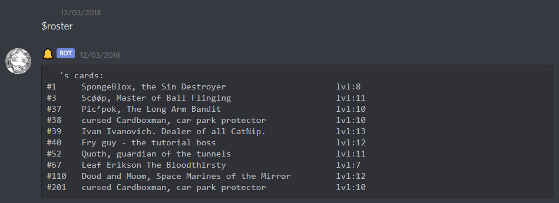

# bossfight_club

Bossfight Club is a proof of concept for a discord based collectible card game where cards are procedurally generated based on reddit posts from the /r/bossfight subreddit. This project is no longer under development. 

## Features

* Randomly generate trading cards with art from the /r/bossfight subreddit.
* Content is scraped using requests and psaw/praw. 
* Simple combat system for players to contest their characters. 
* Fully implemented database with an interface using sqlalchemy. 

## Screenshots
### Example Card

### Example Duel

### Example Roster

## Dependencies:

- discord-py 
- sqlalchemy
- psaw
- requests

## Acknowledgements:

Thanks to [schrodingerskitty](https://github.com/SchrodingersKitty) for introducing me to and assisting me with SQLAlchemy, and doing a lot of work on the backend. 